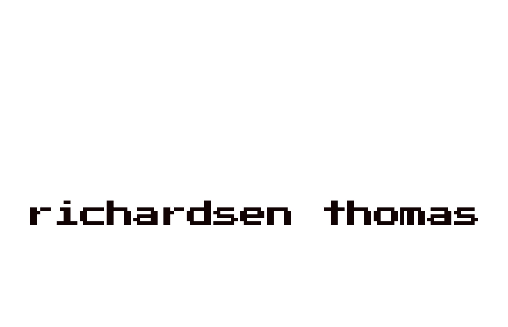
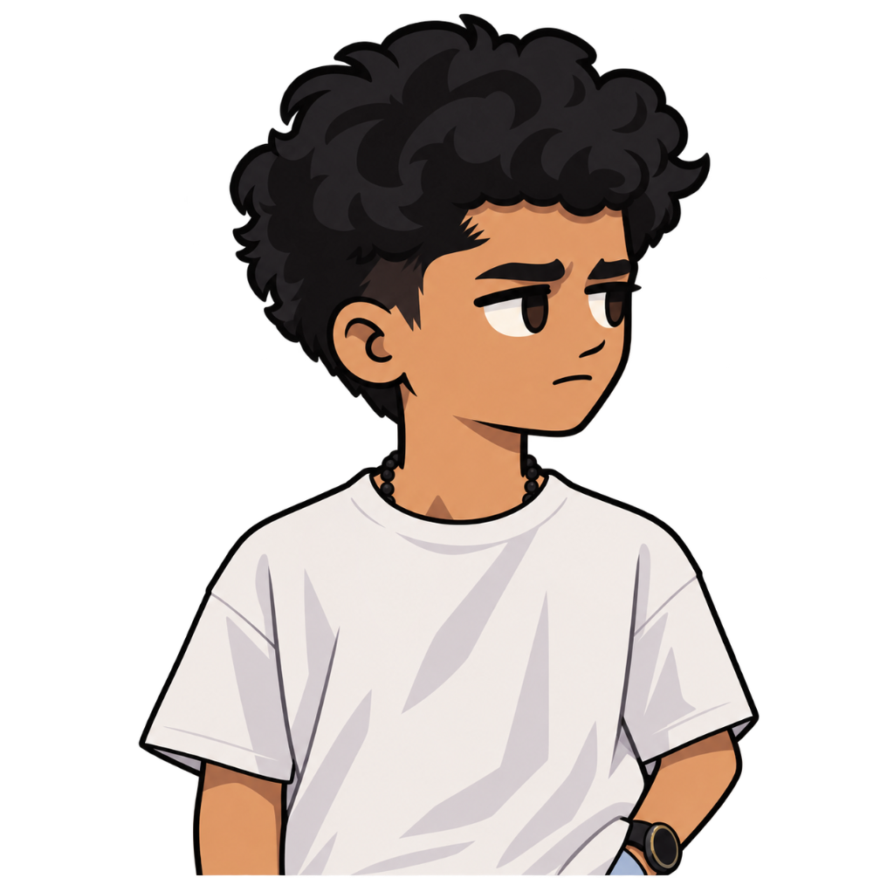
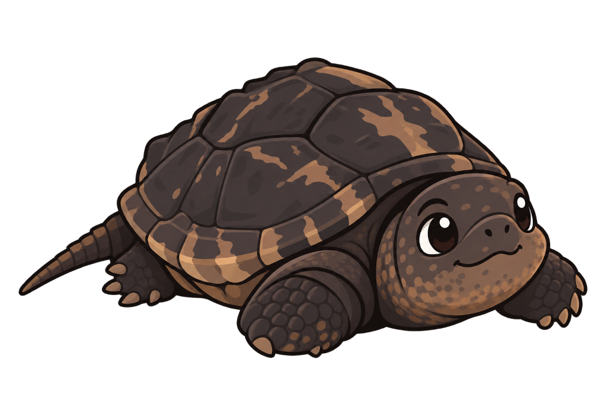

  

<!-- ==================== ABOUT ME ==================== -->

<table align="center" border="0" style="border-collapse: collapse; border: none; width: 100%;">
  <tr style="border: none;">
    <td width="38%" align="center" valign="middle" style="border: none; padding-right: 20px; background-color:#03468f;">
      
    </td>
    <td width="62%" valign="middle" style="border: none; font-size: 1rem; line-height: 1.7; color: #c9d1d9;">
      Hello! My name is <b>Richardsen Thomas</b>, and I am a <b>Designer, Developer &amp; Dreamer</b>.  
      I am someone who really likes turning ideas into things that actually work. I love exploring <b>Artificial Intelligence, software development, design, and creative technology</b> — anything that lets me build something innovative.  
      I work across both the creative and technical parts of projects: writing code, designing interfaces, and discovering unconventional ways to solve problems. Constantly building, learning from curiosity, and exploring new frontiers.
       
       
  

  &nbsp;
  &nbsp;
  
  

    </td>
  </tr>
</table>

 

 

<!-- ==================== CURRENTLY BUILDING ==================== -->

  &nbsp;
  <strong style="font-size: 1.25rem;"><i>Currently Building</i></strong>

<table width="100%" style="border-collapse: separate; border-spacing: 12px; border: none;">
  <tr valign="top">
    <!-- Card 1: chatTUI -->
    <td width="33.33%" align="left" valign="top" style="border: 1px solid #30363d; border-radius: 8px; padding: 16px;">
      <a href="https://github.com/rtomswastaken/chattui" style="text-decoration: none; color: inherit;">
        

          <strong style="font-size: 1.15rem; color: #58a6ff;">chatTUI</strong>
          &nbsp;&nbsp;
          
        

        

          A lightweight, decentralized real-time terminal chat platform built from scratch in Go. Features rich TUI navigation, private networking over Tailscale, SQLite persistence, and channel-based rooms.
        

      </a>
      

        
        
        
        
      

      

        <a href="https://github.com/rtomswastaken/chattui" style="color: #58a6ff; font-weight: 600; text-decoration: none; font-size: 0.85rem;">GitHub &rarr;</a>
      

    </td>

    <!-- Card 2: Oriah IDE -->
    <td width="33.33%" align="left" valign="top" style="border: 1px solid #30363d; border-radius: 8px; padding: 16px;">
      <a href="https://github.com/rtomswastaken/Oriah-IDE" style="text-decoration: none; color: inherit;">
        

          <strong style="font-size: 1.15rem; color: #58a6ff;">Oriah IDE</strong>
          &nbsp;&nbsp;
          
        

        

          An all-in-one agentic terminal IDE unifying diverse AI coding models and autonomous agents within a single customizable terminal workspace with multi-tab editing and live execution.
        

      </a>
      

        
        
        
      

      

        <a href="https://github.com/rtomswastaken/Oriah-IDE" style="color: #58a6ff; font-weight: 600; text-decoration: none; font-size: 0.85rem;">GitHub &rarr;</a>
      

    </td>

    <!-- Card 3: Time Table Thingy -->
    <td width="33.33%" align="left" valign="top" style="border: 1px solid #30363d; border-radius: 8px; padding: 16px;">
      <a href="https://github.com/rtomswastaken/Time-Table-Thingy" style="text-decoration: none; color: inherit;">
        

          <strong style="font-size: 1.15rem; color: #58a6ff;">Time Table Thingy</strong>
          &nbsp;&nbsp;
          
        

        

          An intelligent timetable generation system designed to optimize academic scheduling through automated constraint-solving rather than rigid manual templates.
        

      </a>
      

        
        
        
      

      

        <a href="https://github.com/rtomswastaken/Time-Table-Thingy" style="color: #58a6ff; font-weight: 600; text-decoration: none; font-size: 0.85rem;">GitHub &rarr;</a>
      

    </td>
  </tr>
</table>

 

 

<!-- ==================== TECHNOLOGIES ==================== -->

  &nbsp;
  <strong style="font-size: 1.25rem;"><i>Technologies</i></strong>

<!-- Languages -->

  
  
  
  
  
  
  
  
  
  
  
  
  
  
  

<!-- AI, Machine Learning & Data -->

  
  
  
  
  
  
  
  
  
  
  
  

<!-- Linux, Systems & Desktop -->

  
  
  
  
  
  
  
  
  
  
  
  
  

<!-- Web & App Development -->

  
  
  
  
  
  
  
  
  
  
  
  
  

<!-- Cloud, DevOps & Databases -->

  
  
  
  
  
  
  
  
  
  
  
  
  
  
  

 

<!-- ==================== STATISTICS ==================== -->

  &nbsp;
  <strong style="font-size: 1.25rem;"><i>Statistics</i></strong>

  

 

 

<!-- ==================== HOBBIES & GOALS ==================== -->

  &nbsp;
  <strong style="font-size: 1.25rem;"><i>Hobbies &amp; Goals</i></strong>

<table align="center" border="0" style="border-collapse: collapse; border: none; width: 100%;">
  <tr style="border: none;">
    <td align="center" valign="middle" style="border: none; padding: 10px 25px;">
      

        <b>Designer &amp; Developer</b> experimenting at the edge of tech &amp; creativity.
      

      

        “I am always building things. Sometimes I break everything. That is just part of the process.”
      

      

        <b>Game Development</b> &nbsp;•&nbsp; <b>3D &amp; Motion Design</b> &nbsp;•&nbsp; <b>Creative Tech</b>
      

    </td>
    <td width="170" align="center" valign="middle" style="border: none; padding-left: 10px;">
      
    </td>
  </tr>
</table>
